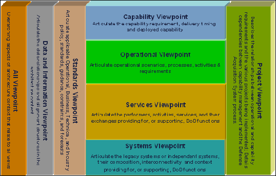
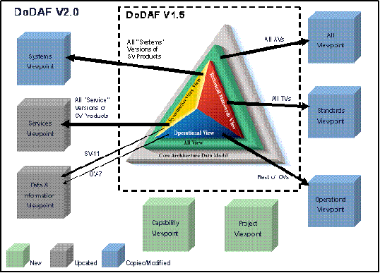

# DoDAF 视点和模型

[原文链接](https://dodcio.defense.gov/Library/DoD-Architecture-Framework/dodaf20_viewpoints/)

设计DoDAF的初衷是满足国防部（DoD）的特定的业务以及作战需求。它定义了企业架构的一种表示方法，让利益相关者能聚焦到企业中特定的、感兴趣的领域，同时能够保留全局的洞察能力。为了协助决策者，DoDAF提供了从底层的复杂性中抽取必要信息的多种手段，并且在提供这些信息的时候能保持连贯与一致性。其中最主要的目标是，在为开发、部署和维护能力的利益相关团体达成使命提供支持时，以一种容易被人理解的方式提供这些信息。为了达到这个目的，它根据利益相关人的视点将问题空间分解成多个可管理的部分，这些多个不同的部分进而被定义成DoDAF-described Model。

每一个视点都有独特的意图，通常提供下面列出的一个或者它们的组合：

- 对整个企业的宽泛信息总结（例如，高层的作战概念）
- 某种特定目的的聚焦信息（例如，系统接口定义）
- 关于企业的各个切面是如何连接的信息（例如，业务或者作战活动是如何被系统支持的，或者项目管理是如何把网络赋能的能力的不同切面组织到一起的）

但是，必须强调的是，DoDAF从根本上是关于创建一致的企业模型，以支持有效的决策。表示层不应该过分强调基于底层数据的图形表示。

DoDAF将DoDAF-described模型组织为下列视点：

- [整体视点](all_viewpoint)描述与所有视点有关的架构上下文（architecture context）的总体。
- [能力视点](capability_viewpoint)说明能力需求，交付时间，以及已部署的能力。
- [数据与信息视点](data_and_information_viewpoint)说明能力和作战需求、系统工程过程、系统和服务的架构内容中的数据关系和组织结构。
- [作战视点](operational_viewpoint)包含为能力提供支持的的作战场景、活动以及需求。
- [项目视点](project_viewpoint)描述作战需求、能力需求以及各种正在实现的项目之间的关系。项目视图详细说明在国防采办系统过程中的能力和作战需求、系统工程过程、系统设计以及服务设计之间的依赖关系。一个例子就是在国防采办指南第四章的Vcharts。
- [服务视点](services_viewpoint)是关于提供作战功能或系统能力的执行者、活动、服务以及它们之间的交换（exchange）的解决方案的设计
- [标准视点](standards_viewpoint)说明应道到能力和作战需求、系统工程过程、系统和服务中的，可落地实施的作战、业务、技术和产业策略、标准、指南、约束和预测。
- [系统视点](system_viewpoint)，用于向前兼容的支持，说明提供或支持作战功能或系统能力的系统及其组合、交互、上下文的解决方案的设计。

上述这些视点可以用如下图形表示：

DoDAF 2.0是一套在支持决策者方面比之前版本更加聚焦的方法。在过去，决策者必须检查DoDAF所提供的东西，然后决定哪些适合应用到决策过程中。例如JCIDS文档中的JCIDS过程架构需求（ICD,CDD,CPD等）。另外，较早版本的架构描述产品都是把内容以及如何图示化的方法硬编码的。很多时候，这些设计产品对它们的目标受众来说难以理解或不太实用。DoDAF 2.0基于过程owner的输入，更加聚焦于架构数据，并且新的展示架构信息的方法已经解决了上述问题。这些视点将模型按如下方式分类：

- 如下图所示，原来的视点（作战视点，系统和服务视点，技术标注视点，以及总体视点）已经将模型重新组织，以更好的服务于各自的意图。老的系统和服务视点中的服务的部分，现在是服务视点，更加详细地说明我们的以网络为中心的或者以面向服务的实现。

- 所有数据的模型（概念模型、逻辑模型或者物理模型）已经放到了数据和信息视点中，而不是分散在作战视点和服务视点中。
- 系统视点兼容了老的系统描述。
- 新的标准视点现在能描述业务、商业和教条的标准，以及那些应用到我们的解决方案中的技术标准，这些解决方案可能包括系统和服务。
- 作战视点现在可以描述任何功能（业务，智能，战事等等）的规则和约束，而不仅仅是那些从数据关系推导出来的东西。
- 由于部门内部对能力集管理的强调，以及来自采办团体的反馈，通过对MODAF和NAF构件的最佳组合分析，加入了能力视点和项目视点。

工作小组通过定义能够应用于系统工程过程DoDAF架构体系，已经让系统工程界和架构界的同仁之间拉近了距离，而且这也使得人们在关于哪些视点的集合和底层的架构数据能用于系统工程流程上取得了共识。没有一种独立的系统工程视点或者DoDAF-described模型，因为系统工程师以及系统工程的决策者能够使用现有的DoDAF-described模型以及它们自己定义的适用的视图。

架构表示方法抛弃了静态的或固定的通用架构模板。我们创造的术语是适用的表示。通过各种各样的技术和应用，把架构模型底层的数据值域每个决策者的问题空间的上下文中，架构数据表示增进了客户的理解，提高了架构对于决策者的价值。

### 视点和DoDAF-described模型描述

下列DoDAF视点和DoDAF-described模型在后面会详细讨论。包括模型的使用和模型的描述。

- [总体视点](all_viewpoint)
- [能力视点](capability_viewpoint)
- [数据和信息视点](data_and_information_viewpoint)
- [作战视点](operational_viewpoint)
- [服务视点](services_viewpoint)
- [标准视点](standards_viewpoint)
- [系统视点](systems_viewpoint)

对于DoDAF-described模型描述，大部分材料源自MODAF。另外包含了系统工程的备注。

DoDAF总描述的视图，包括之前的框架中那些老的视图，都是以预定义的示例的方式提供的，供开发架构数据的表示之用。

DoDAF在部门内用于开发架构描述。用于特定目的的特定的DoDAF-described模型是有过程的所有者给出的。所有的DoDAF-described模型都不是必须创建的。DoDAF V2.0是适用的，视决策者的需求而定。DoDAF 不给出任何特定的视图，而是专注于架构开发中必须的要素--数据。当然，其它来自DoD和CJCS的规定或说明也许会有特别的表示视图需求。这些视图都是被DoDAF 2.0所支持的，在有特殊的视图需求时可以参考。
